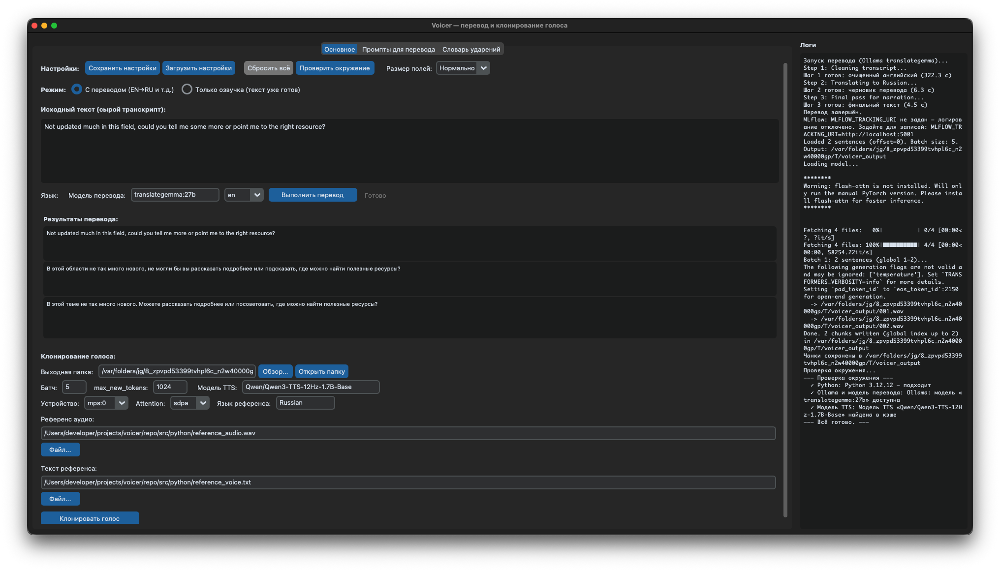
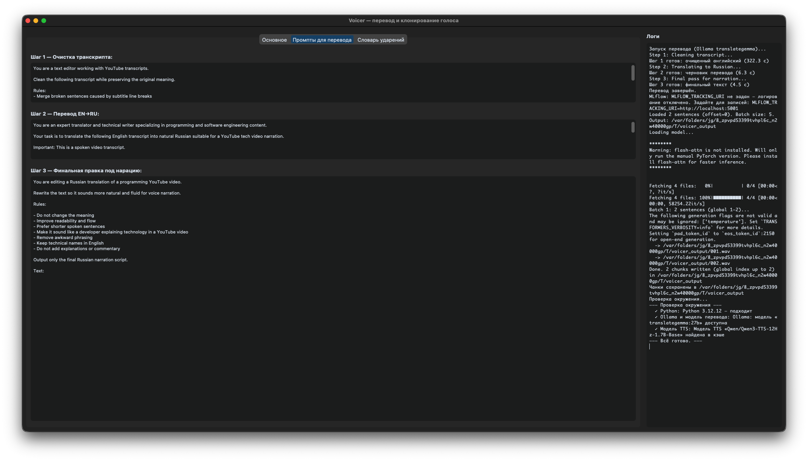
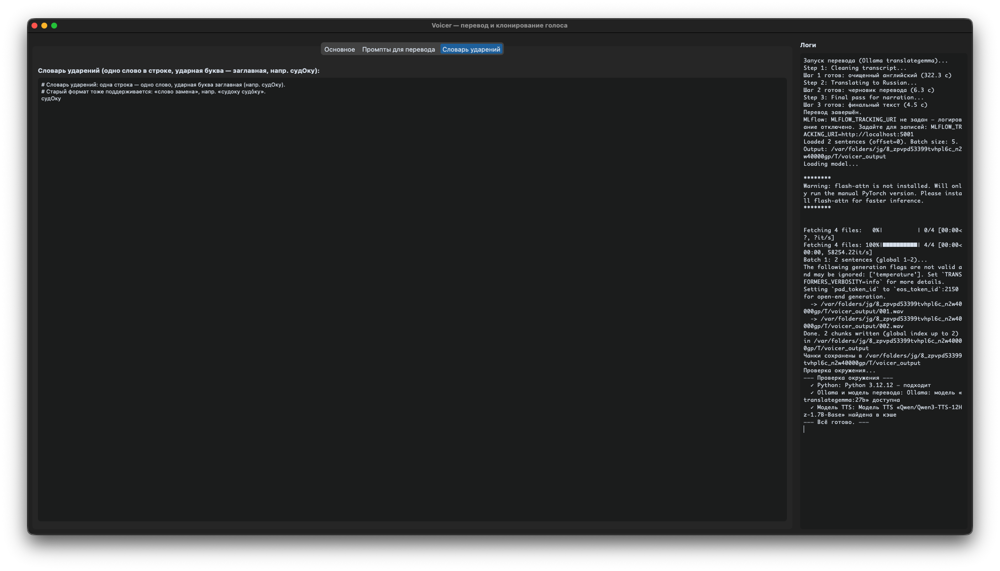

# Voicer

Перевод текста (Ollama + translategemma) и клонирование голоса на основе [Qwen3-TTS](https://github.com/QwenLM/Qwen3-TTS). Десктопное приложение (CustomTkinter) и CLI: можно переводить сырой транскрипт в три шага и озвучивать результат одним голосом по референсу.

**Автор:** Marat Zimnurov (<zimtir@mail.ru>)  
**Лицензия:** [LICENSE](LICENSE) (EN), [LICENSE-RU.md](LICENSE-RU.md) (RU). При коммерческом использовании обязательна атрибуция; при заработке на продукте приветствуется доля автору (в т.ч. через [digitable.ru](https://digitable.ru)). ПО «как есть», без гарантий.







- [voice_demo 1](./examples/output-translated-clone.wav)
- [voice_demo 2](./examples/001.wav)
- [voice_demo 3](./examples/002.wav)

---

## Требования

- **Python 3.12**
- **Poetry** (или pip)
- **Ollama** с моделью `translategemma:27b` (для перевода)
- **PyTorch** с MPS (Apple) или CUDA (NVIDIA)
- Локальный **Qwen3-TTS** в каталоге `Qwen3-TTS/` (подмодуль или клон)

## Установка

### Из репозитория (рекомендуется для разработки)

```bash
git clone https://github.com/the-homeless-god/voicer.git voicer && cd voicer
poetry install

# to run desktop
make app

# to translate
make translate
# Вход: src/python/reference_text_to_translate.txt
# Выход: src/python/translated.txt

# Свои файлы:
INPUT=path/to/input.txt OUTPUT=path/to/translated.txt make translate
# или напрямую:
poetry run python src/python/translate_with_gemma.py path/to/input.txt -o path/to/translated.txt

# Клонирование в один WAV-файл** (использует `translated.txt` и референсы из `src/python/`):

```bash
make clone
# Результат: src/python/output-translated-clone.wav
```

**Клонирование по предложениям в папку чанков** (основной сценарий для озвучки):

```bash
make clone-chunks
# Вход: src/python/translated.txt
# Выход: src/python/chunks/*.wav

# Свои пути и параметры:
poetry run python src/python/clone_chunks.py path/to/translated.txt -o path/to/chunks/ --batch-size 8 --max-new-tokens 512

# С референсами, моделью, устройством и языком:
poetry run python src/python/clone_chunks.py input.txt -o out/ \
  --ref-audio ref.wav --ref-text ref.txt \
  --model Qwen/Qwen3-TTS-12Hz-1.7B-Base \
  --batch-size 5 --max-new-tokens 1024 \
  --device mps:0 --attn-implementation sdpa --language Russian
```

Для `make clone` (один WAV) можно задать устройство, attention и язык через переменные окружения: `VOICER_DEVICE=mps:0`, `VOICER_ATTN=sdpa`, `VOICER_LANGUAGE=Russian`.

Батч по умолчанию — 5; для ускорения можно увеличить `--batch-size` (больше памяти) и уменьшить `--max-new-tokens` для коротких фраз.

**Проверка окружения** (Ollama, модель перевода, TTS):

```bash
poetry run python src/python/env_check.py
```

**MLflow** — логирование запусков перевода и клонирования (параметры, метрики, артефакты):

1. Запустите сервер MLflow в одном терминале (порт 5001, т.к. на macOS 5000 часто занят AirPlay):

   ```bash
   make mlflow
   # или: poetry run python -m mlflow server --port 5001
   ```

2. В другом терминале задайте переменную окружения и выполните команду:
   - для перевода: `MLFLOW_TRACKING_URI=http://localhost:5001 make translate`;
   - для клонирования по чанкам: `MLFLOW_TRACKING_URI=http://localhost:5001 make clone-chunks`  
     или `poetry run python src/python/clone_chunks.py ... --tracking-uri http://localhost:5001`.
3. Откройте в браузере `http://localhost:5001`, выберите эксперимент `voicer`. Во вкладке **Runs** — параметры (batch_size, device, input, output_dir и т.д.) и залогированные артефакты (папка чанков для clone_chunks). Трейсы перевода (по шагам) отображаются во вкладке **Traces** при использовании MLflow GenAI.

Без `MLFLOW_TRACKING_URI` (или без `--tracking-uri`) логирование в MLflow не выполняется.

---

## Тесты и линтер

- **Тесты:** `make test` или `poetry run pytest tests/ -v`. Тесты в `tests/`: `test_stress_utils.py` (словарь ударений), `test_clone_chunks.py` (разбиение на предложения). Тесты `clone_chunks` помечаются skip, если модуль не удаётся импортировать (нет qwen_tts/torch).
- **Black:** проверка форматирования — `make lint` (`poetry run black --check src/python tests`); автоформатирование — `make format` (`poetry run black src/python tests`).

В CI (GitHub Actions) при push/PR в `master`/`main` запускаются `black --check` и `pytest`. См. [.github/workflows/ci.yml](.github/workflows/ci.yml).

---

## Сборка приложения (локально)

Один раз установите PyInstaller: `poetry add --group dev pyinstaller && poetry install`. Затем:

```bash
make build-app
# или
poetry run python build_app.py
```

Результат: **macOS** — `dist/Voicer.app`, **Windows** — `dist/Voicer/` (папка с exe), **Linux** — `dist/Voicer/`. Сборку под каждую ОС нужно выполнять на ней же (или использовать CI при релизе).

## Лицензия

- Некоммерческое и коммерческое использование разрешено при соблюдении лицензии.
- Коммерческое использование: обязательна атрибуция (Voicer by Marat Zimnurov).
- Заработок на продукте: приветствуется доля автору (в т.ч. [digitable.ru](https://digitable.ru)).
- ПО «как есть», без гарантий. Подробно: [LICENSE](LICENSE), [LICENSE-RU.md](LICENSE-RU.md).
